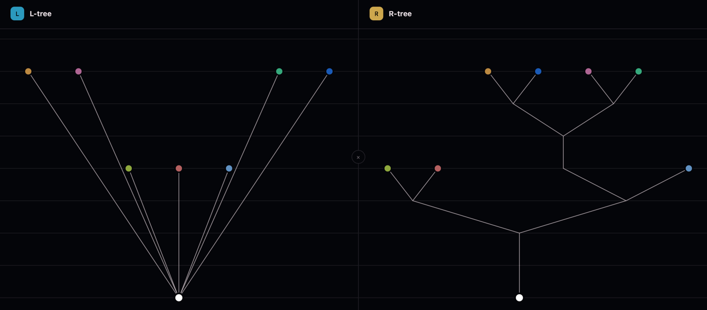

Graphical implementation of the 

- layered coding of [Barmpalias and Lewis-Pye (2019)](https://arxiv.org/abs/1710.02092)
- simplified by [Shen (2023)](https://arxiv.org/pdf/2304.04852))

which dynamically converts multi-branching to equivalent 2-branching trees.

Clicking above a node in the left tree creates a successor of length the grid-distance of the node from the click.

